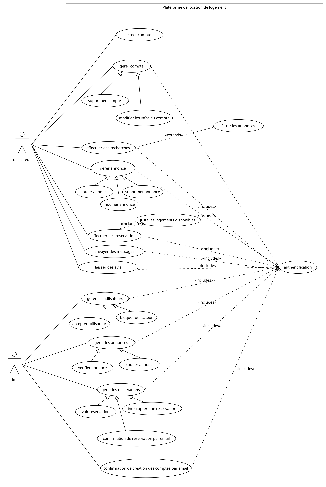

# UML
## Projet du Contrôle UML - Plateforme de Location de Logements

### Description du Cahier des Charges - Plateforme de Location de Logements

Ce cahier des charges détaille les spécifications fonctionnelles et techniques nécessaires pour le développement d'une Plateforme de Location de Logements. L'objectif principal est de concevoir une application conviviale, similaire à Airbnb, permettant aux utilisateurs de louer et de mettre en location des logements.

## Contenu du Cahier des Charges

1. **Introduction :** Présente l'objectif du document et le contexte du projet, énonçant la vision globale de la plateforme.

2. **Exigences Fonctionnelles :** Décompose les fonctionnalités clés de la plateforme, telles que l'inscription et la gestion de profil, la création et la gestion d'annonces, la recherche avancée, le processus de réservation, la messagerie intégrée, et le système d'avis et d'évaluations.

3. **Exigences Techniques :** Spécifie les choix technologiques, tant au niveau du backend que du frontend, en mettant l'accent sur la sécurité et l'optimisation des performances.

4. **Plan de Développement :** Divise le processus de développement en phases distinctes, de la conception à la mise en production, en détaillant les étapes clés à accomplir.

5. **Livrables Attendus :** Enumère les résultats anticipés du projet, tels que l'application déployée, la documentation technique, les rapports de tests, et le manuel d'utilisation.

6. **Gestion de Projet :** Établit une structure pour la gestion du projet, avec des réunions régulières, des rapports d'avancement, et une communication transparente.

## Diagrammes UML

### Class Diagram

Le diagramme de classes modélise la structure statique de la plateforme, identifiant les entités principales telles que Utilisateur, Annonce, Réservation, etc., ainsi que leurs relations et attributs.

### Use Case Diagram

Le diagramme de cas d'utilisation décrit les interactions entre les acteurs (Utilisateur, Administrateur) et le système, mettant en évidence les fonctionnalités offertes par la plateforme.

### Sequence Diagram - S'authentifier

Le diagramme de séquence pour le processus d'authentification illustre les interactions entre l'Utilisateur et le système, détaillant les étapes de connexion.

### Sequence Diagram - Rechercher Annonce

Le diagramme de séquence pour la recherche d'annonces décrit les étapes impliquées dans la requête et la récupération des annonces correspondantes.

### Sequence Diagram - Gérer Réservation

Le diagramme de séquence pour la gestion des réservations présente les interactions entre l'Utilisateur et le système lors de la création et de la modification des réservations.

Ce cahier des charges et ces diagrammes UML serviront de référence cruciale tout au long du développement de la plateforme, assurant une compréhension commune entre les parties prenantes et les membres de l'équipe de développement.

